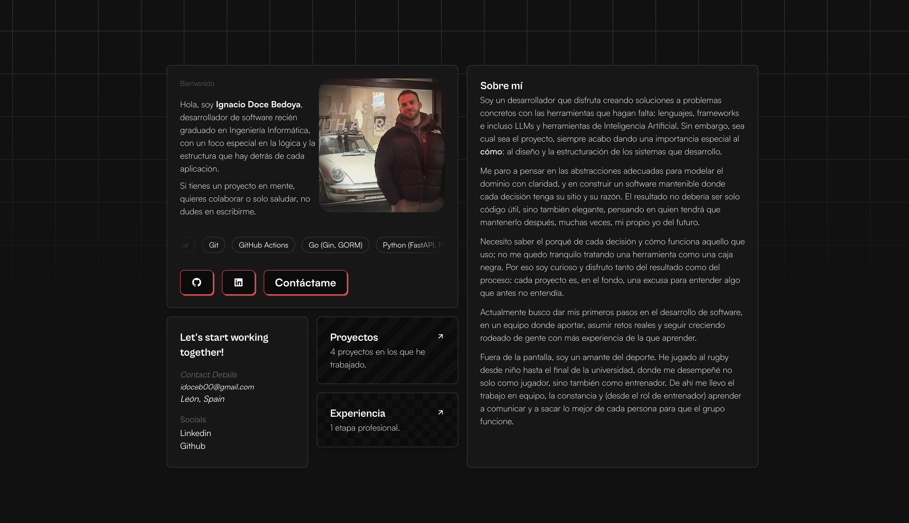

# Portfolio

My personal portfolio — a fast, fully static single-page site that presents who
I am, the tools I work with, and the projects I've built. Designed around a
bento-grid layout with a fixed dark theme.

<!-- Ajusta el usuario/repo si el badge no coincide con tu repositorio real -->
[](https://github.com/idoceb00/portfolio/actions/workflows/ci.yml)
[](./LICENSE)

**Live:** [https://<tu-portfolio>.vercel.app <!-- pon aquí tu URL de Vercel -->](https://portfolio-drab-tau-gjgnoggu4c.vercel.app/)



## Tech stack

- **[Astro](https://astro.build/)** — static output, zero JavaScript shipped by default
- **[Svelte 5](https://svelte.dev/)** — interactive islands using runes (`$state`, `$derived`, `{#snippet}`)
- **[UnoCSS](https://unocss.dev/)** — utility-first styling (`presetWind3`)
- **[astro-icon](https://www.astroicon.dev/)** — Remix Icons (`ri:` prefix)
- **TypeScript** — centralized, typed site configuration and content
- **pnpm** — package manager (version pinned via the `packageManager` field)

## Features

- Fully static output — the whole site ships as pre-rendered HTML
- Bento-grid layout with a fixed dark theme
- Content and configuration centralized in typed `.ts` files (`site-config.ts`,
  dedicated data files for projects and experience) rather than scattered across
  components
- Clear separation between page structure and interactive component logic
- Accessibility-conscious: dedicated `sr-only` copy so screen readers get clean,
  linear text while the visual layout stays rich
- Privacy-friendly analytics via Umami event tracking
- Content written in Spanish

## Getting started

### Prerequisites

- Node.js 22+
- [pnpm](https://pnpm.io/)

### Install and run

```bash
pnpm install
pnpm dev
```

The dev server runs at `http://localhost:4321`.

### Build

```bash
pnpm build      # build the static site into dist/
pnpm preview    # preview the production build locally
```

### Typecheck

```bash
pnpm astro check
```

## Project structure

```
src/
├── assets/          Images and static assets
├── components/      Astro + Svelte components (bento cards)
├── lib/             Constants and shared data
├── pages/           Routes
└── site-config.ts   Central site configuration
```

## Deployment

Deployed on [Vercel](https://vercel.com/): every push to `main` triggers an
automatic production deploy. A GitHub Actions workflow (`.github/workflows/ci.yml`)
runs typecheck and build on every push and pull request.

## Credits

Built on top of the **astro-bento-portfolio** template,
adapted under the MIT license. Full attribution is in [`NOTICE.md`](./NOTICE.md).

## License

Released under the [MIT License](./LICENSE).